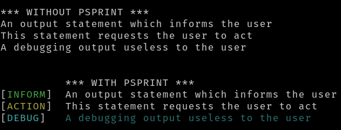

Documentation
=============

[Read The Docs](https://psprint.readthedocs.io/en/latest/?badge=latest)
[](https://psprint.readthedocs.io/en/latest/?badge=latest)

Installation
============

pip
---

Preferred method `pip install psprint`

[pspman](https://github.com/pradyparanjpe/pspman)
-------------------------------------------------

For automated management: updates, etc
`pspman -s -i https://github.com/pradyparanjpe/psprint.git`

Uninstallation
==============

pip
---

`pip uninstall -y psprint`

pspman
------

Remove installation `pip uninstall -y psprint`

Remove repository clone `pspman -s -d psprint`

Configuration
=============

Although prefix can be defined on the fly by passing \*\*kwargs, such
definition may be slow and should be avoided. Frequently used prefixes
should be declared in a configuration file located at standard
locations. Configuration file is in [yaml](https://yaml.org/spec/)
format.

Location of configuration files
-------------------------------

Configuration may be specified in any of the following locations:

### Root (UNIX ONLY):

This is inhereted by all users of the system

`/etc/psprint/style.yml`

### User (HOME):

**This is discouraged.** Maintaining configuration files in `$HOME` is a
bad practice. Such configuration should be in `$XDG_CONFIG_HOME`.

\`\$HOME/.psprintrc\`

### User (XDG~CONFIGHOME~):

This variable is generally set to `$HOME/.config` on unix-like systems.
Even if unset, we will still try the `$HOME/.config` directory.

`$XFG_CONFIG_HOME/psprint/style.yml`

### Local:

In the current working directory

`.psprintrc`

Configuration format
--------------------

### Sections

1.  FLAGS

    Following variables may be set as boolean value forms (yes, true,
    false, no).

    -   short: Information prefix is short (1 character).
    -   pad: Information prefix is fixed length, padded with \<space\>
        wherever necessary.
    -   flush: This is passed to python\'s print function.

    Following variables may be set to string values

    -   sep: This is passed to python\'s print function.
    -   end: This is passed to python\'s print function.
    -   file: *Discouraged* STDOUT gets **appended** to `file`. This may
        be risky as the file is [opened out of context]{.underline}

    ``` {.yaml tangle=".psprintrc"}
    FLAGS:
      # short = False
      pad: True
      flush: True
      # sep =
      # end =
    ```

2.  `custom`

    The `custom` string is used as prefix index while calling print
    function Following variables may be set as string names or integers
    (ANSI Terminal colors)

    -   pref~color~: color of information prefix \[black, red, g, 5,
        light blue\]
    -   pref~gloss~: brightness of information prefix \[normal, n, 1,
        dim, d, 2, bright, b, 3\]
    -   pref~bgcol~: background of information prefix \<same as
        pref~color~\>
    -   text~color~: color of information text \[black, red, g, 5, light
        blue\]
    -   text~gloss~: brightness of information text \[normal, n, 1, dim,
        d, 2, bright, b, 3\]
    -   text~bgcol~: background of information text \<same as
        text~color~\>

    Following variables may be set as str

    -   pref: \<10 character long information prefix string (long form)
    -   pref~s~: 1 character information prefix (short form) *Remember
        quotes for special characters*

    ``` {.yaml tangle=".psprintrc"}
    help:
      pref: HELP
      pref_s: "?"
      pref_color: yellow
      pref_bgcol: black
      pref_style: normal
      text_color: white
      text_style: normal
      text_bgcol: black
    ```

Usage
=====

Substitute python\'s print
--------------------------

Import in your script

-   `from psprint import print`

What does it do
---------------

``` {.python tangle="docs/example.py"}
#!/usr/bin/env python3
# -*- coding: utf-8 -*-

print()
print("*** WITHOUT PSPRINT ***")
print("An output statement which informs the user")
print("This statement requests the user to act")
print("A debugging output useless to the user")
print()

from psprint import print
print()
print("*** WITH PSPRINT ***")
print("An output statement which informs the user", mark=1)
print("This statement requests the user to act", mark=2)
print("A debugging output useless to the user", mark='bug')
print ()
```

Screenshot: 
